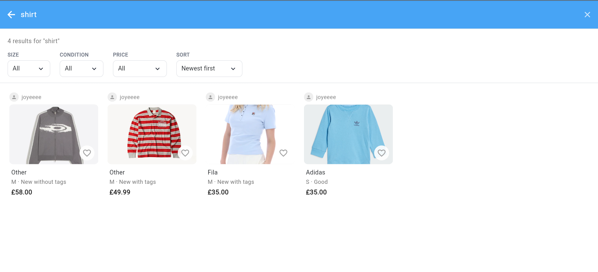
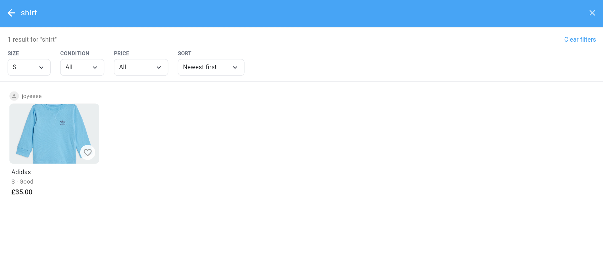
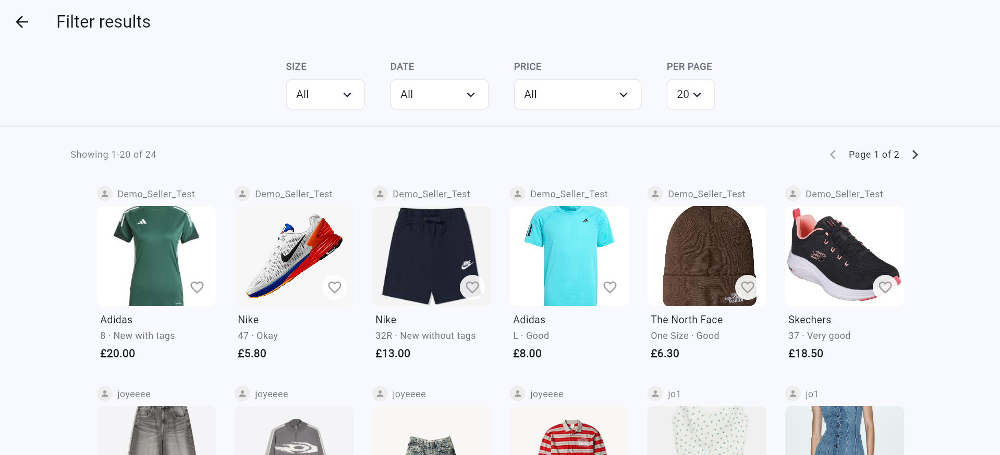

Requirement 1: Users should be able to Filter Items
===========================================================
User should be able to use the search bar
--------------------------------
.. image:: ../images/req1/sec1/image1.png
    :width: 600px
    :align: center
    :alt: Image of the project page
The user begins by opening the main marketplace page where all available clothing listings are displayed.

.. image:: ../images/req1/sec1/image2.png
    :width: 600px
    :align: center
    :alt: Image of the project page
The user selects the search bar, enters a keyword related to the item they are looking for, such as "jacket", "dress", "Nike", or "denim". In this case, the user searches for "shirts" and submits the search to view matching listings.

.. image:: ../images/req1/sec1/image3.png
    :width: 600px
    :align: center
    :alt: Image of the project page
When the user presses Enter, the system redirects them to a results page displaying listings that match the entered keyword.

The user can use filters such as size, condition, and price to narrow down the search results; for example, if the user selects size “S”, the system will only display listings that match the selected size.

User should be able to use the filter system
--------------------------------

The user opens the marketplace page and selects the filter option to refine the available listings. They can choose one or more filter categories, such as department, size, brand, price range, colour, condition, material, or item type. For example, if the user selects size “S”, the system will only display listings that match the selected size.

If the user does not wish to refine any categories, they can simply click “Apply”, and the system will display all available listings.
