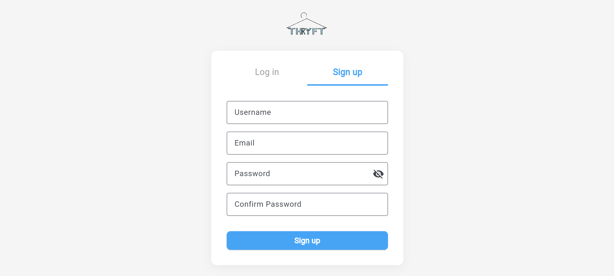
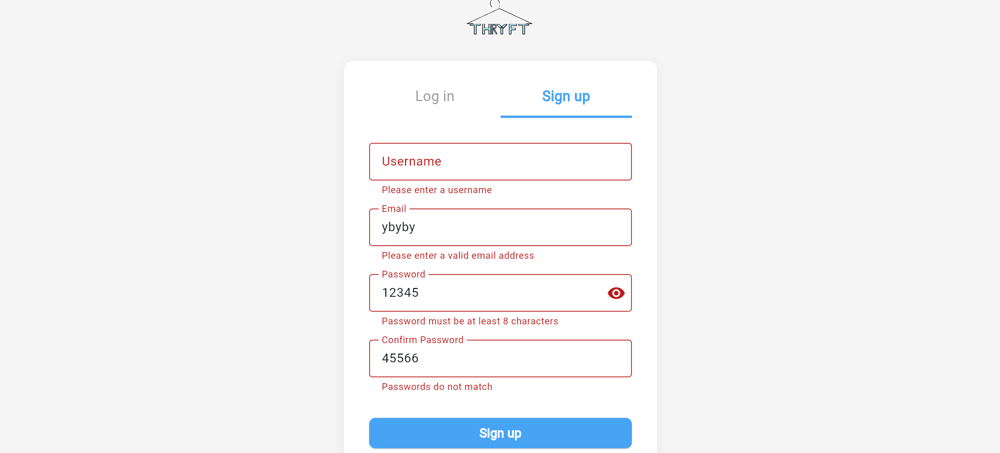
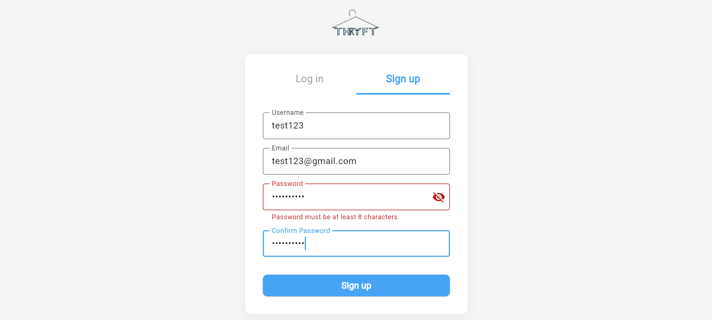
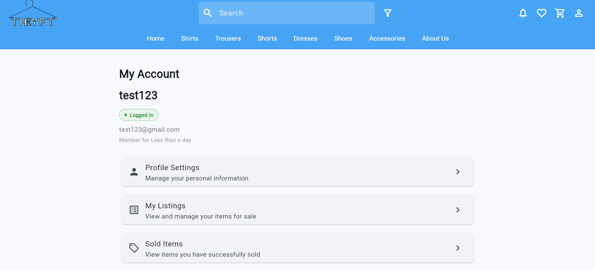
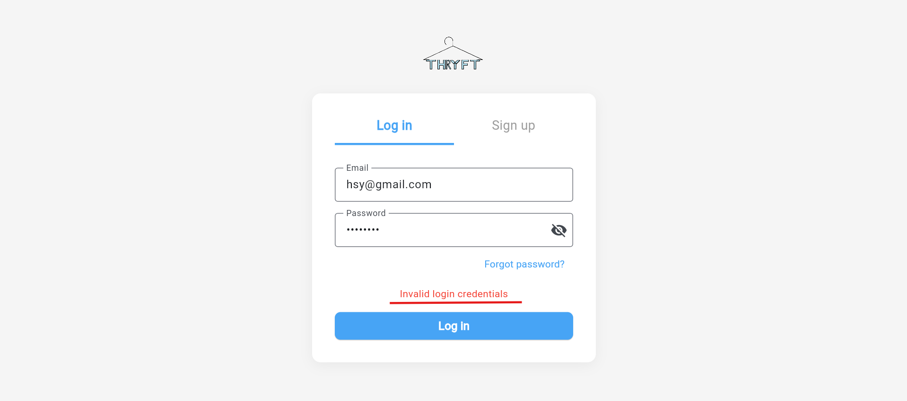
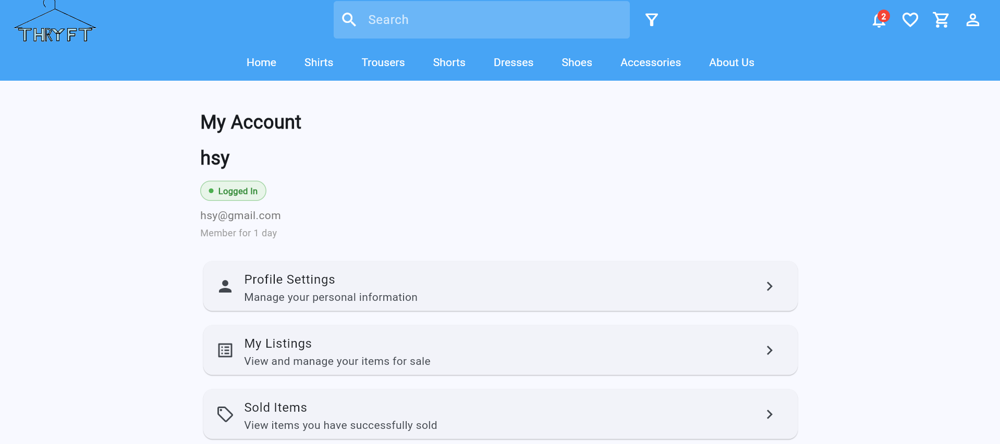

Requirement 10: Users Should Be Able to Register and Log in Securely  
===========================================================
User should be able to create account
--------------------------------

New users can select the “Create Account” option to register for an account by entering the required details, such as their username, email address, password, and confirmed password, while the password input remains hidden during typing to improve privacy and security. 

The system then validates the entered information by checking for empty fields, duplicate usernames, valid email formats, and whether the password and confirmed password match before successfully creating the account and allowing the user to log in. 

Once the user successfully completes and satisfies all required sign-up fields, the system will automatically log the user into the app and redirect them to the homepage.

User should be able to login to their existing account
--------------------------------

When an existing user attempts to log in, the system will validate whether the entered email address and password are correct. If either the email or password is entered incorrectly, the system will display an error message stating “Invalid login credentials”.

Existing users can select the “Login” option and enter their registered email and password to access the app and protected features such as creating listings, managing orders, saving wishlist items, and making offers.
