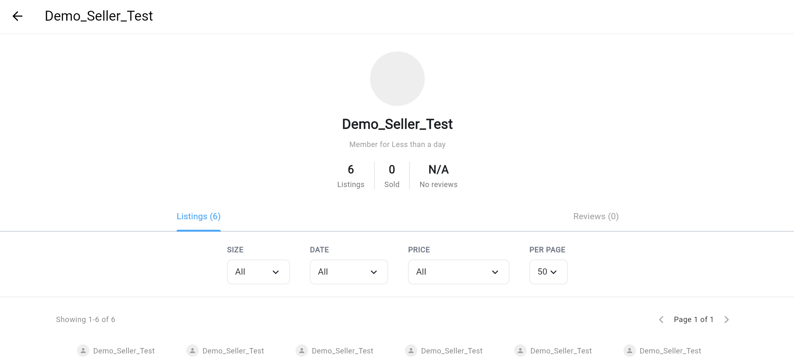
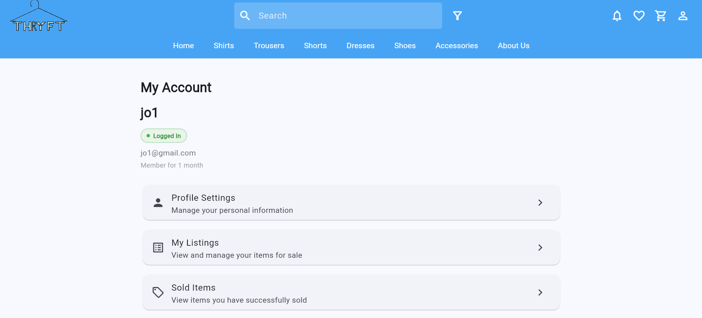
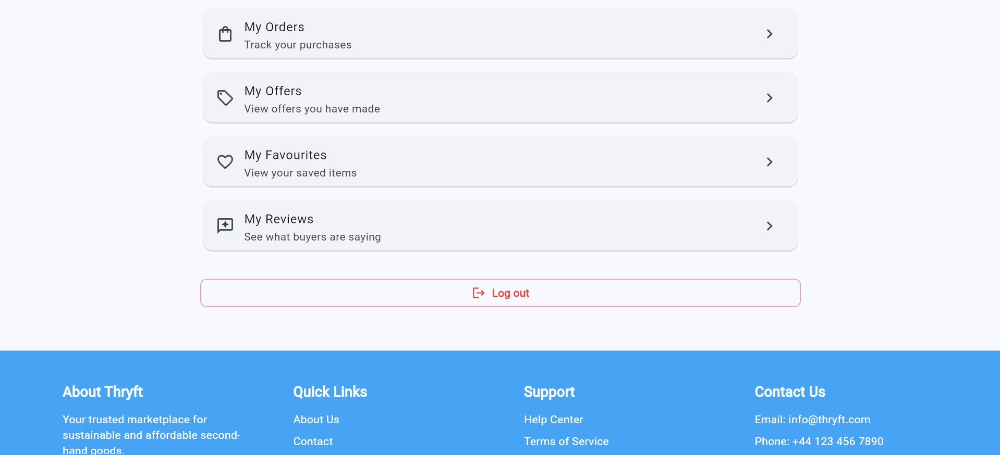
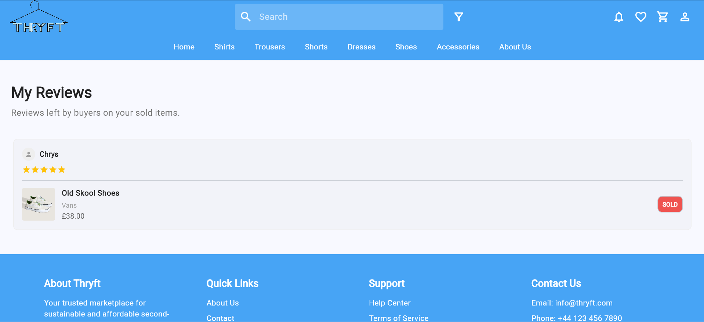

Requirement 2: Users Should be able to View Seller Trust Information
===========================================================
A logged in User should be able to view the seller's profile, ratings and reviews
--------------------------------
.. image:: ../images/req2/sec1/image1.png
    :width: 600px
    :align: center
    :alt: Image of the project page
The user opens a listing from the marketplace page and selects the seller’s profile or trust information section. 

.. image:: ../images/req2/sec1/image2.png
    :width: 600px
    :align: center
    :alt: Image of the project page
The system then redirects the user to the seller’s profile page, where they can view information such as ratings, reviews, account age, and past or active listings to determine whether the seller is trustworthy. 

.. image:: ../images/req2/sec1/image3.png
    :width: 600px
    :align: center
    :alt: Image of the project page

If the seller has no ratings or reviews, the system will display an appropriate message such as “No ratings available.”

A logged in User should be able to view their own ratings and reviews
--------------------------------

When users log in to the system, they can access the “My Reviews” section through the “My Account” page to view reviews and ratings left by buyers on their profile.

Users can view each buyer’s review and rating, which are important in helping them determine whether a seller is trustworthy and reliable before making a purchase or sending an offer.
