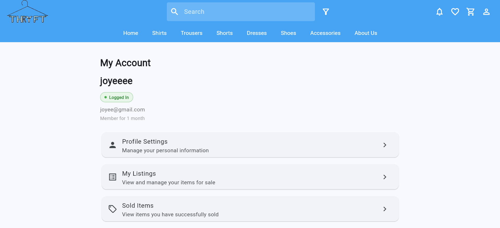
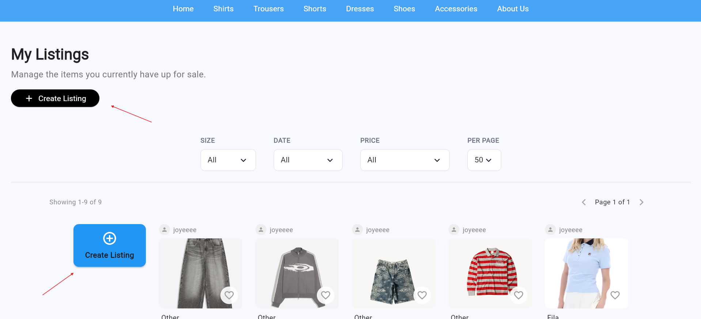
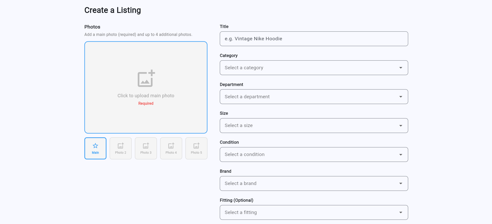
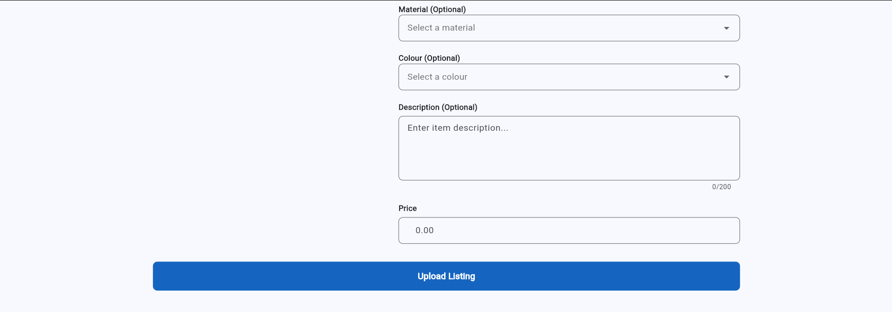

Requirement 3: Users should be able to create listings easily
===========================================================
User should be able to create listings
--------------------------------

The user must first log in to their account before they are able to create a listing.

After the user logs in to their account and selects the “Create Listing” option either through the “Sell Now” button on the marketplace page or from the account section. 

Within the account section, users can choose either the black “Create Listing” button or the blue “Create Listing” button to open the listing creation form, where they can upload an image and enter item details before submitting the listing.

The system then opens the listing creation form, where the user can upload an image and enter item details such as the product name, category, size, condition, price, colour, material, and description before submitting the listing. Once the input has been validated successfully, the listing is saved to the system, displayed in the marketplace, and can later be managed through the user’s account section.
