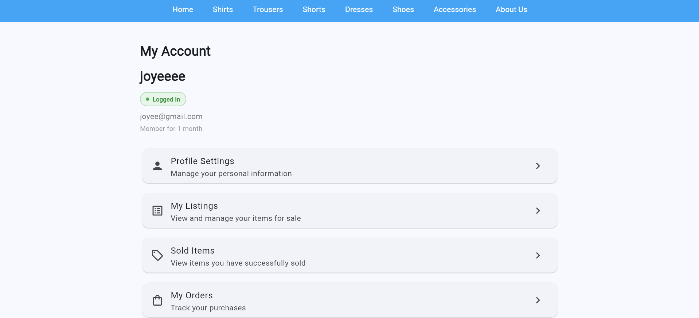
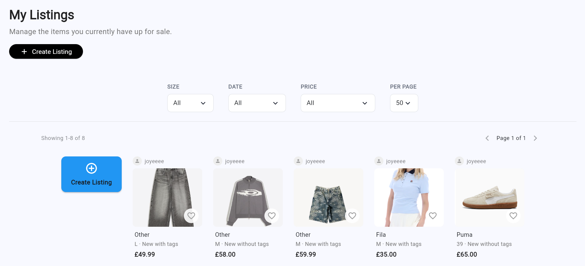
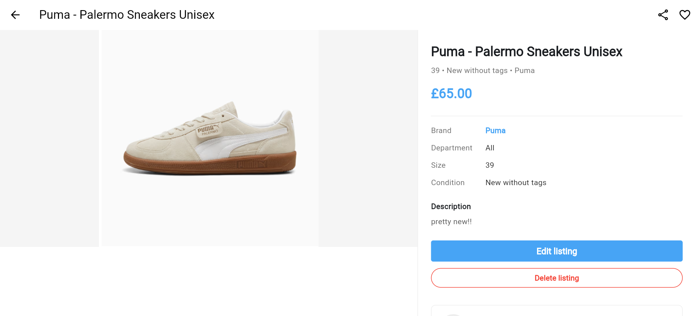
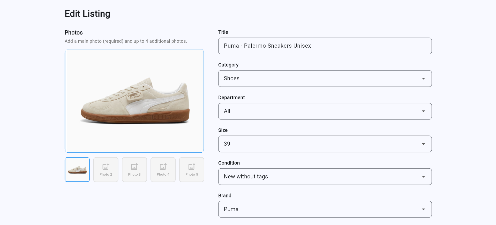
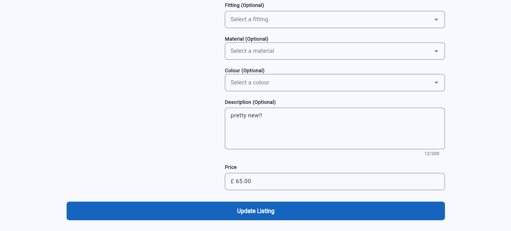
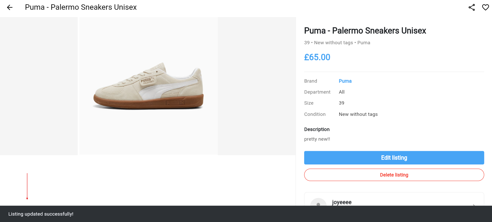
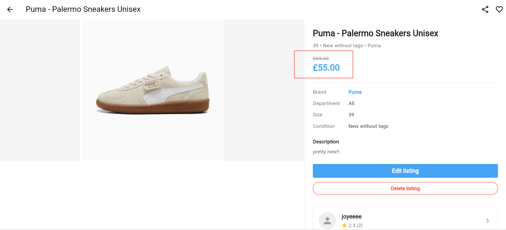
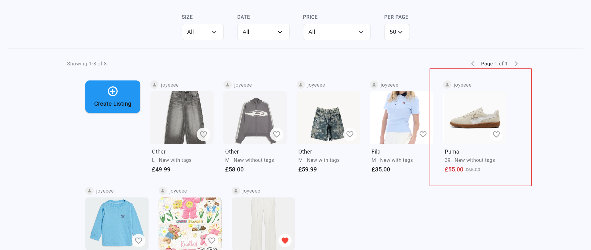
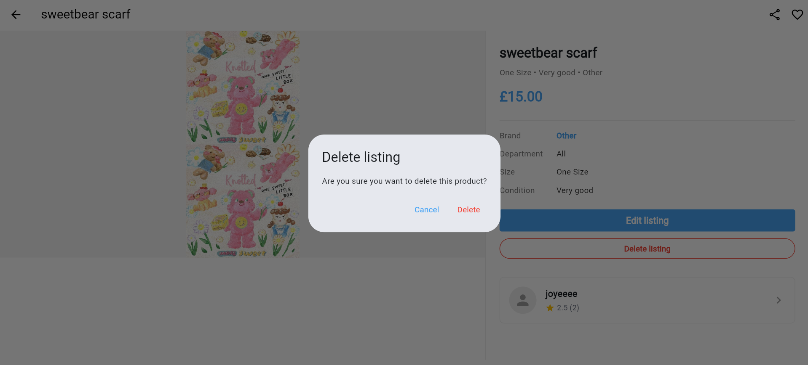
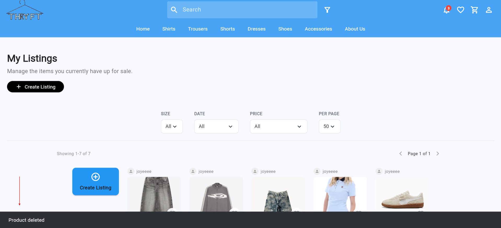

Requirement 4: Users should be able to edit and manage their listings
===========================================================
User should be able to edit listings
--------------------------------

The user must first log in to their account before accessing the “My Account” section.

Where they can view all of their active listings in the listing management area. 

Before editing or deleting a listing, the user must first open the specific listing they want to manage. 

The user can select a listing to edit details such as the title, price, condition, description, colour, material, or image, and any changes made will be saved and updated in the marketplace.

When the user successfully edits a listing and clicks the “Update Listing” button, the system will automatically save and update the changes in the marketplace. A snackbar notification displaying “Listing updated successfully” will then appear on the screen to confirm that the update was completed successfully.

For example, if the user changes the price of a Puma shoe listing from £66 to £55 and clicks the “Update Listing” button, the system will automatically update the new price across the platform. The updated price will then be displayed on the homepage, the “My Listings” page, and the individual listing page when users open the listing details.

User should be able to delete listings
--------------------------------

Users can also delete listings they no longer want to display in the marketplace, which will permanently remove the item from public view and prevent other users from interacting with it.

When the user successfully deletes a listing and clicks the “Delete Listing” button, the system will automatically remove the listing from the marketplace and update all related pages. A snackbar notification displaying “Product deleted” will then appear on the screen to confirm that the listing has been removed successfully.
