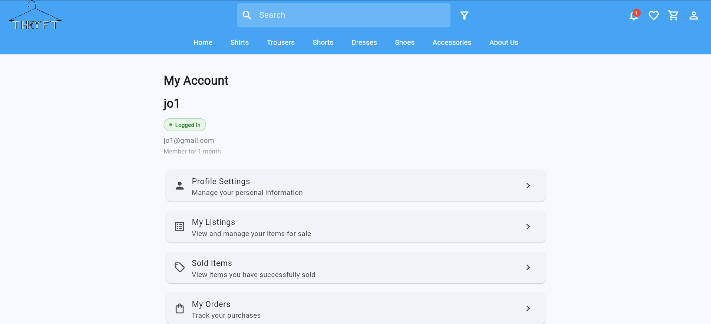
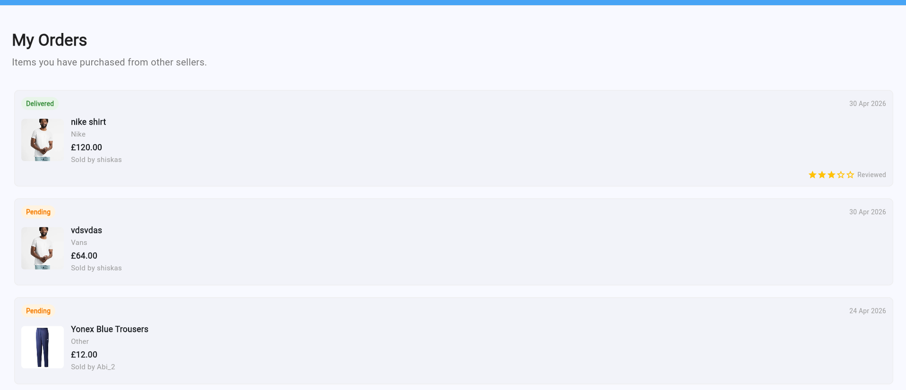
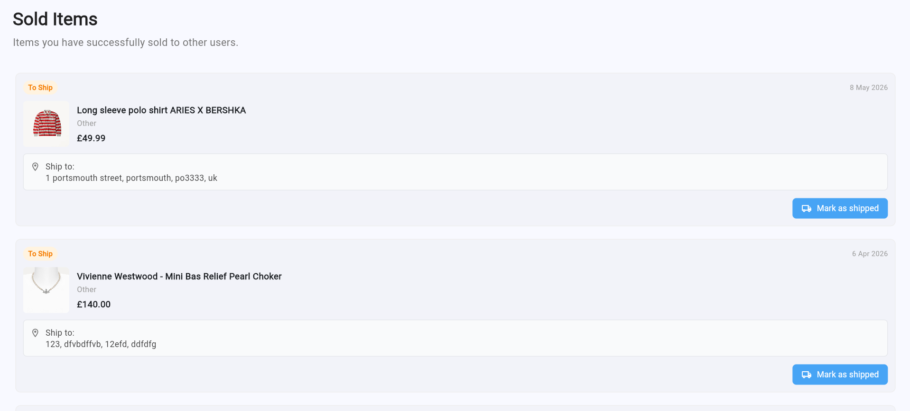
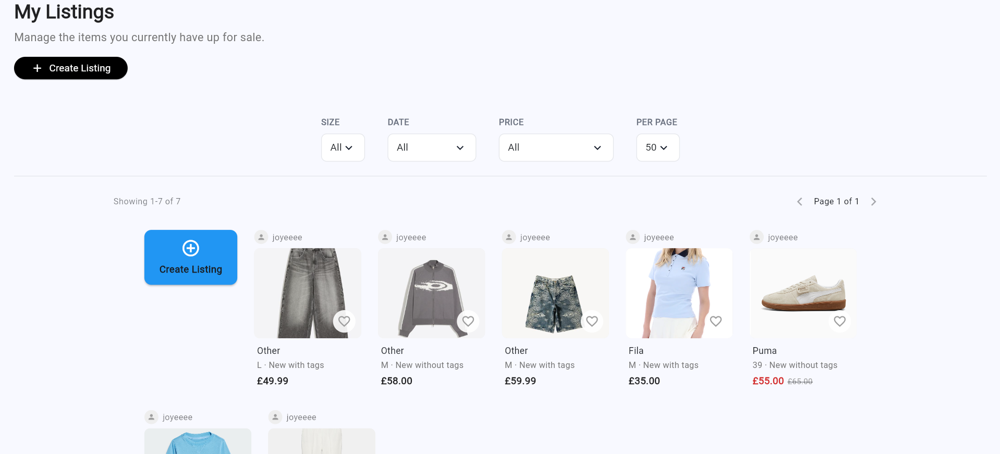
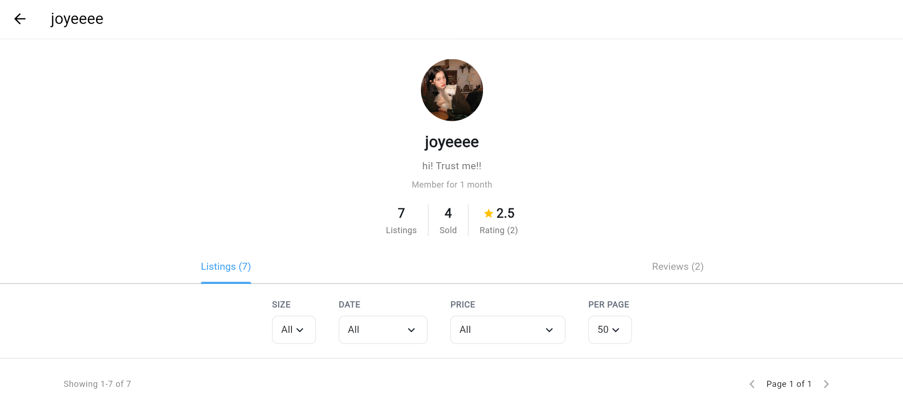
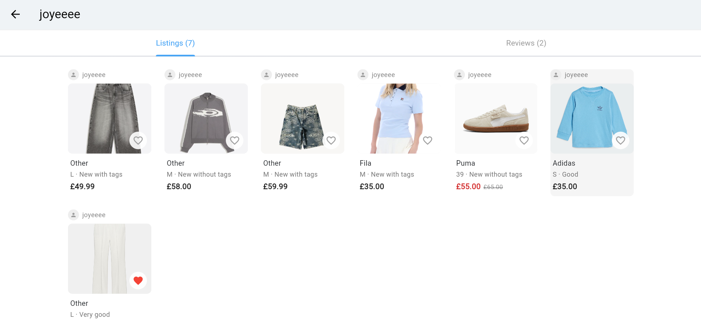

Requirement 5: Users Should Be Able to View Their Purchase and Listing History  
===========================================================
User should be able to view their purchase listings
--------------------------------

The user must first log in to their account before accessing the “My Account” section, where they can view their buying and selling activity through different pages such as “My Orders”, “Sold Items”, and “My Listings”.

The “My Orders” page displays all items the user has successfully purchased, including relevant information such as the product image, product name, purchase price, order status, and purchase date, allowing users to track and review their previous purchases easily. 

User should be able to view their sold listings
--------------------------------

The “Sold Items” page displays all listings that have been marked as sold, enabling sellers to monitor completed transactions and manage their selling history within the app.

User should be able to view their listings history
--------------------------------

Meanwhile, the “My Listings” page displays all current active listings created by the user that are still available in the marketplace, where users can manage, edit, or delete their listings when needed.

Users can also select any item from these sections to view the related product details, while deleted listings will no longer appear in the listing history. In addition, after creating a listing, users can verify that the listing has been successfully saved into the system by viewing it through the “My Listings” page or through their user profile. This feature allows users to keep track of their buying and selling activities within the app in an organised and efficient manner.
