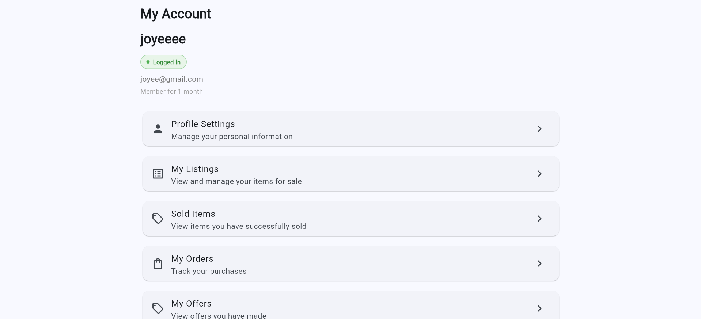
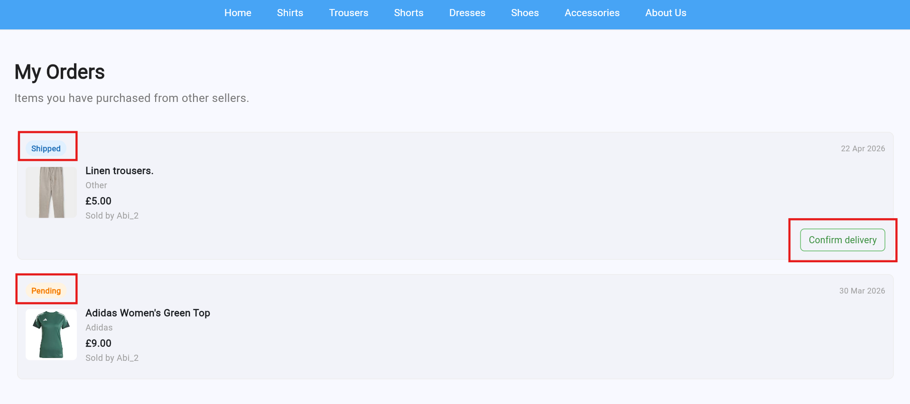
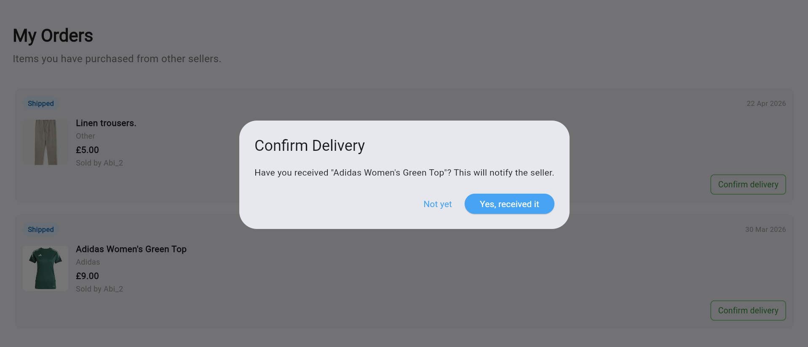
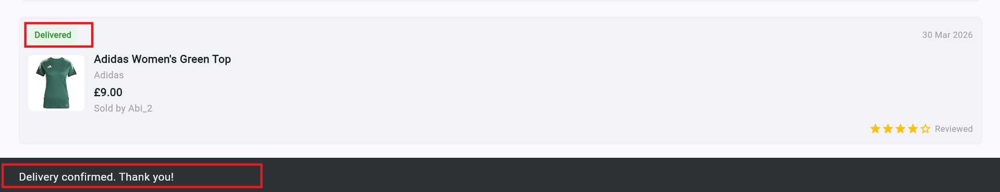
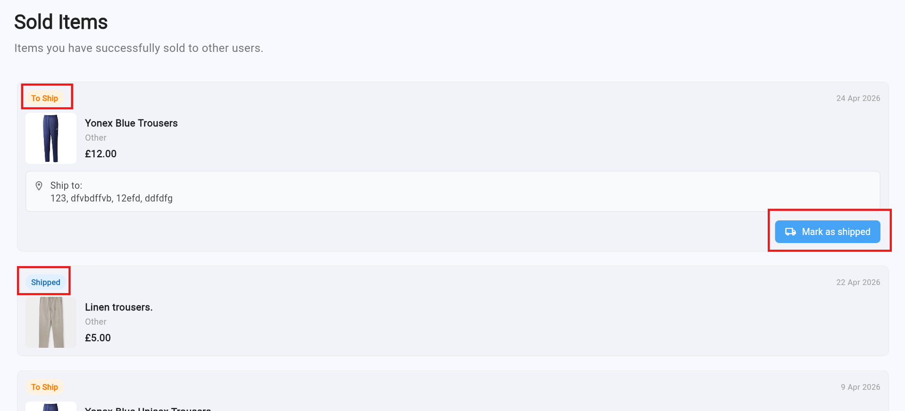
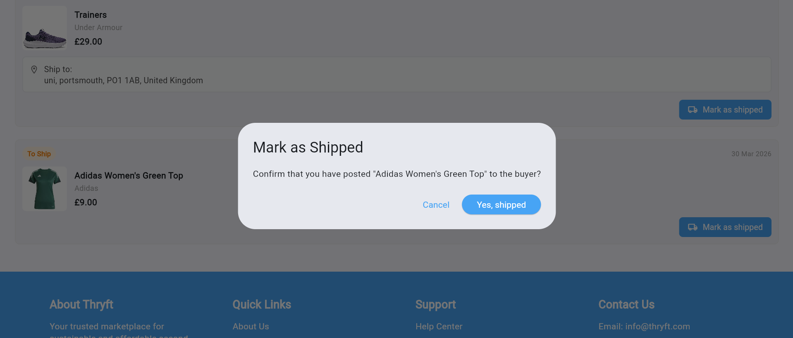
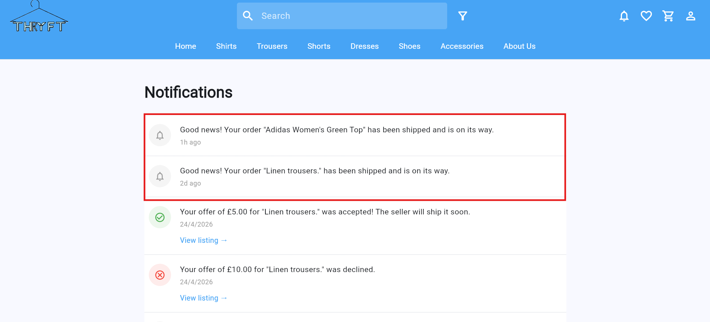
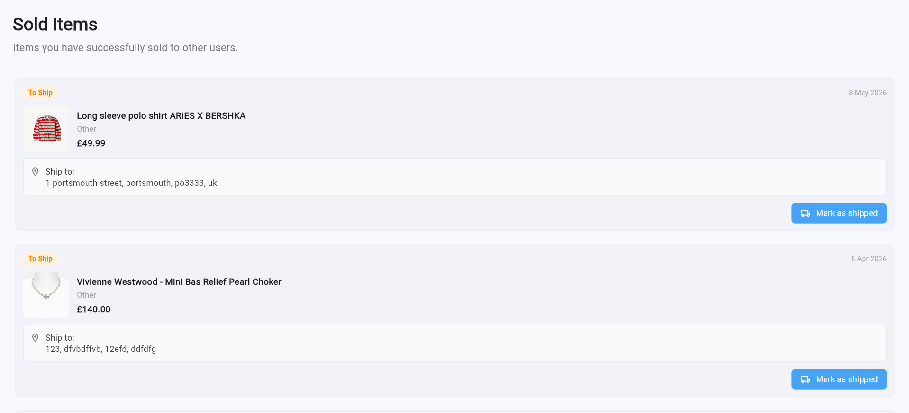
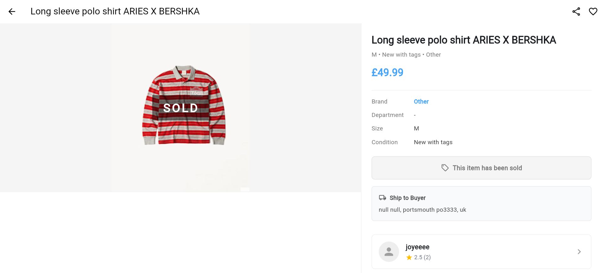

Requirement 6: Buyers Should Be Able to Track Their Orders   
===========================================================
User should be able to track their orders
--------------------------------

The buyer must first log in to their account before accessing the “My Orders” page, where they can view purchased items and track their current order status. 

From the buyer’s perspective, when the buyer opens the “My Orders” page, they can view the current status of their orders, such as whether the item is still pending or has been shipped by the seller.

If the order status has been updated to “Shipped”, the buyer can press the “Confirm Delivery” button on the “My Orders” page and select “Yes, received it.” once the item has been received, which will then update the order status within the system.

Once the buyer confirms delivery, the order status on the “My Orders” page will automatically change from “Shipped” to “Delivered”. A snackbar notification displaying “Delivery confirmed. Thank you!” will then appear on the screen to confirm that the delivery status has been updated successfully.

Once an item has been purchased, the system automatically marks the listing as “Sold”. From the seller’s perspective, when the seller opens the “Sold Items” page, they can view the current order status, such as whether the item is still “To Ship” or has already been marked as “Shipped”. 

Once the seller has sent the item, they can press the “Mark as Shipped” button and select “Yes, Shipped”, which will update the order status within the system. 

When the seller updates the order status, The buyer will then receive a notification informing them that their purchased item has been shipped and is on its way. After the item has been received, the buyer can mark the order as “Received”, which updates the order status within the system and allows both buyer and seller to monitor the transaction progress.

User should be able to view sold listings
--------------------------------

When the seller wants to check which listings have been sold, they must first go to the “My Account” section and open the “Sold Items” page. The system will then display all items that have been marked as sold, allowing the seller to view and manage their completed sales.

In addition, when an item has been successfully purchased, the system will automatically update the listing status to “Sold” to inform other users that the item is no longer available for purchase or offers. This helps maintain accurate listing information and prevents duplicate purchases.
