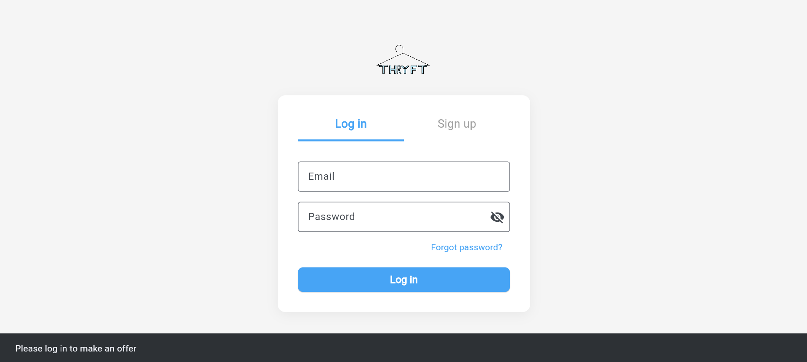
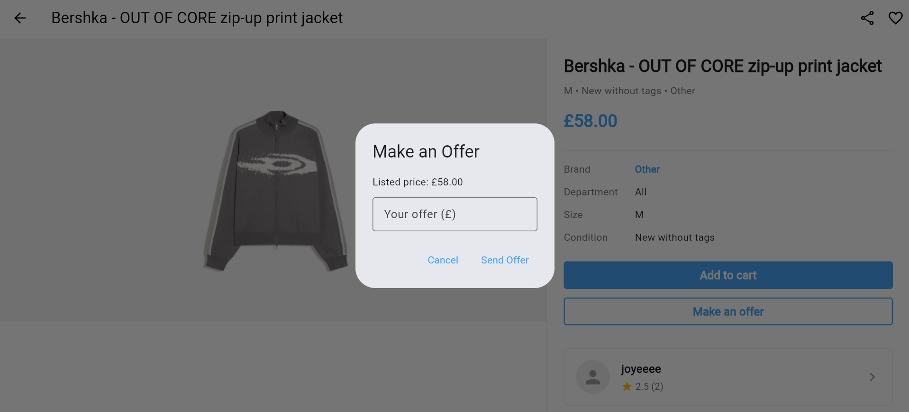
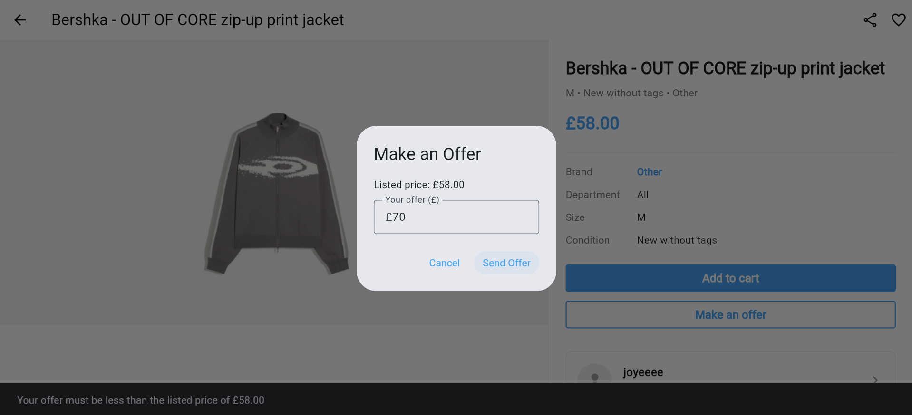
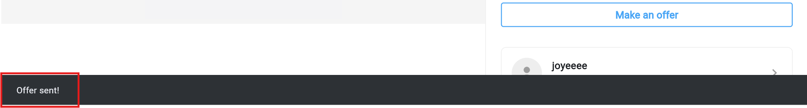
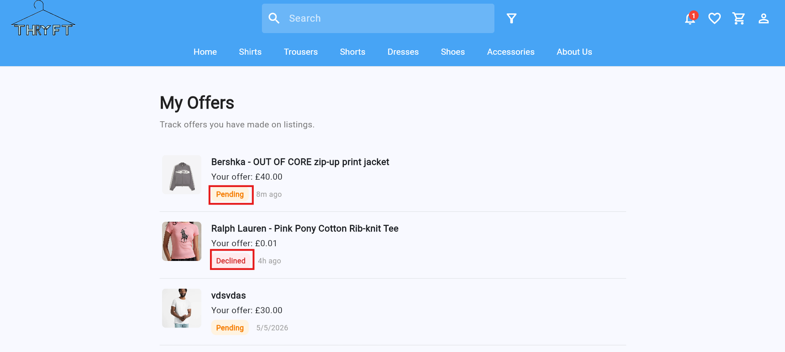
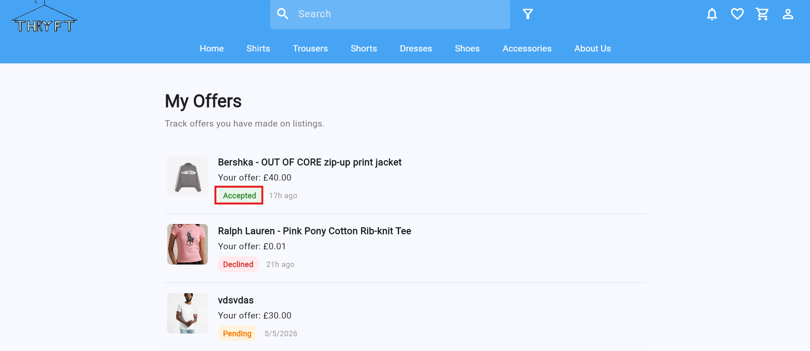

Requirement 7: Buyers should be able to negotiate offers about products to sellers 
===========================================================
User should be able to make an offer to the sellers
--------------------------------

The buyer must first log in to their account before opening the marketplace and selecting the listing they are interested in. 

On the listing details page, the buyer can select the “Make Offer” option and enter an offer price for the item.

If the entered offer is greater than the original listing price, the system will display a snackbar notification stating “Your offer must be less than the listed price of £[price]”. 

After the system validates that the offer is greater than £0 and does not exceed the original listing price, a snackbar notification displaying “Offer sent!” will appear on the screen to confirm that the offer has been submitted successfully.

If the offer is valid, it will be saved with a “Pending” status and displayed in the buyer’s “My Offers” page, where they can track whether the offer has been accepted, declined, or is still pending. 

If the seller accepts the offer, the buyer will be able to see the offer status change from “Pending” to “Accepted” on the “My Offers” page.

