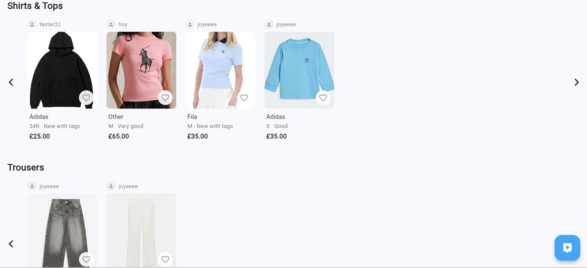
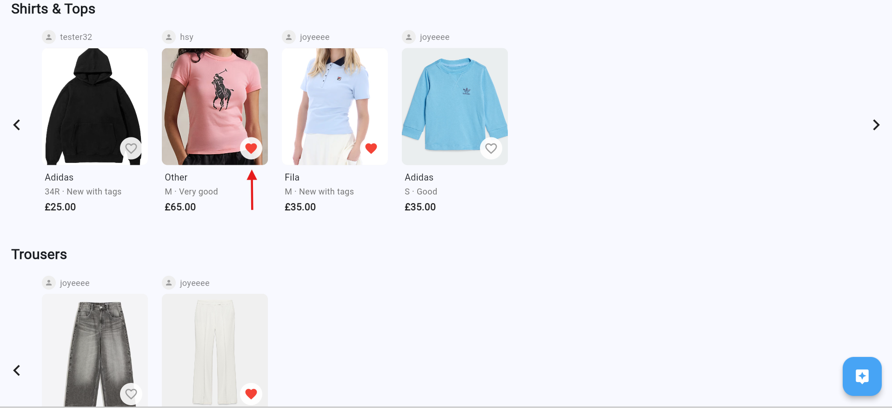
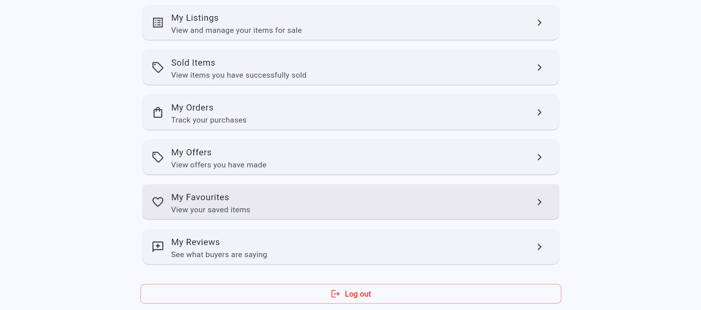
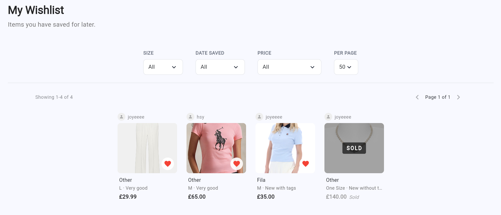
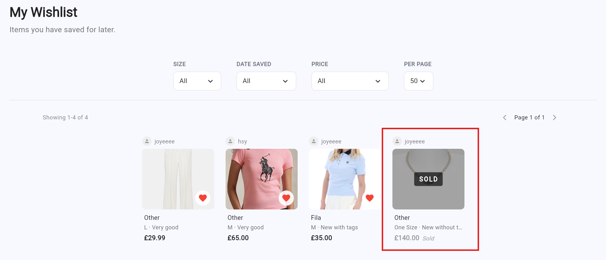
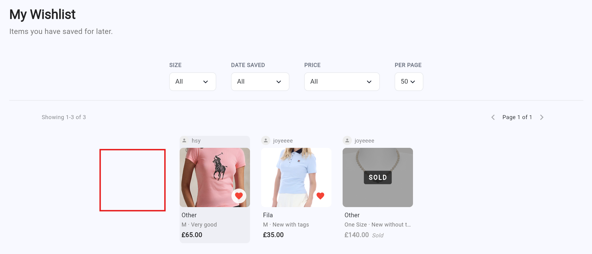
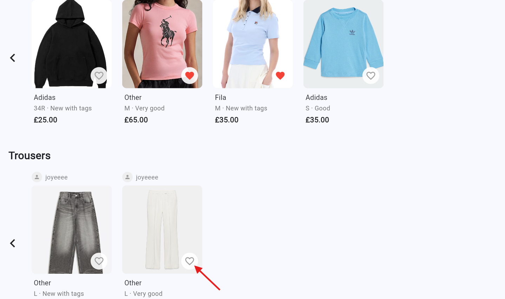

Requirement 8: Users should be able to save listings (Wishlist)
===========================================================
User should be able to save listings and view in the whishlist
--------------------------------

The user must first log in to their account before opening the marketplace page and selecting a listing they are interested in. 

On the listing details page, the user can click the wishlist or save button, after which the system checks whether the listing is eligible to be added to the wishlist by verifying that the item is still available, not sold, and not created by the user themselves. 

If the listing meets all conditions, the item will be saved to the user’s wishlist and can later be accessed through the “Wishlist” section at the "My Account" page.

This feature allows users to keep track of items they are interested in while preventing sold items or self-created listings from being added to the wishlist. However, if an item has already been added to the user’s wishlist before it is sold, the item will remain visible in the wishlist with a “Sold” status displayed, allowing the user to know that the wished item is no longer available for purchase.

If the user no longer wishes to save the item, they can remove it from the wishlist at any time, after which the unsaved item will automatically be removed from both the “Wishlist” page and the homepage wishlist section.
