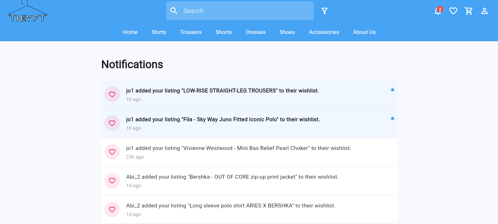
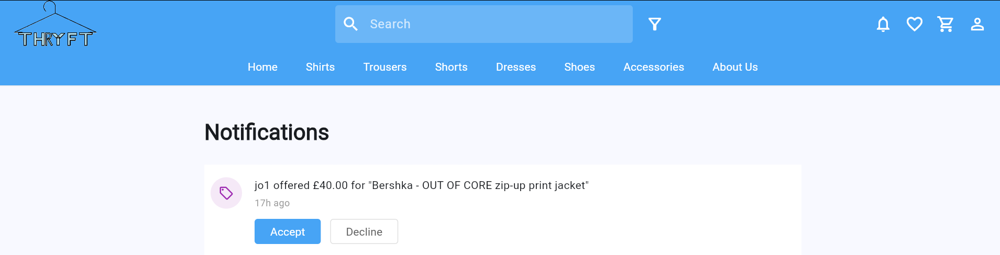
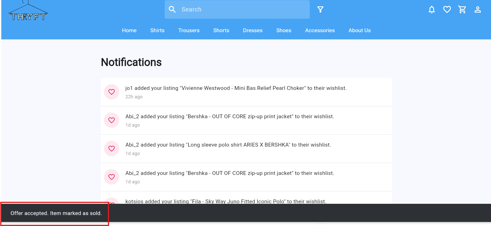
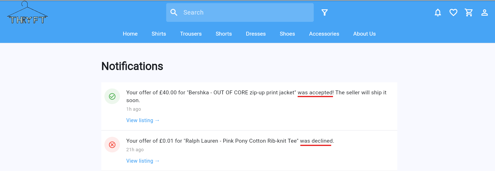

Requirement 9: Users Should Receive Notifications for Wishlist Updates, and New Offers 
===========================================================
User should be able to receive notifications for Wishlist Updates
--------------------------------

The user must first log in to their account before accessing the “Notifications” page through the header section, where the system displays notifications related to their activity within the app, such as offer updates, wishlist updates, item availability changes, and order status updates. 

User should be able to receive notifications for New Offers
--------------------------------

The seller will receive a notification about the new offer and can either accept or decline it through the notifications page, after which the buyer will receive a notification showing the updated offer status and the seller’s decision.

If the seller accepts the offer, a snackbar notification displaying “Offer accepted. Item marked as sold.” will appear on the screen, meaning that once the seller accepts the offer, the item will automatically be considered sold within the system.

After the seller accepts or declines the offer through the notifications page, the buyer will receive a notification showing the seller’s decision. If the seller accepts the offer, the notification will display “Your offer for [listing’s name] was accepted! The seller will ship it soon.” However, if the seller declines the offer, the notification will display “Your offer for [listing’s name] was declined.”

In addition, when a seller marks an item as shipped, the buyer will receive a notification informing them that the purchased item has been shipped and is on its way. This feature allows users to stay informed about important updates related to their purchases, offers, orders, and saved items within the system.
